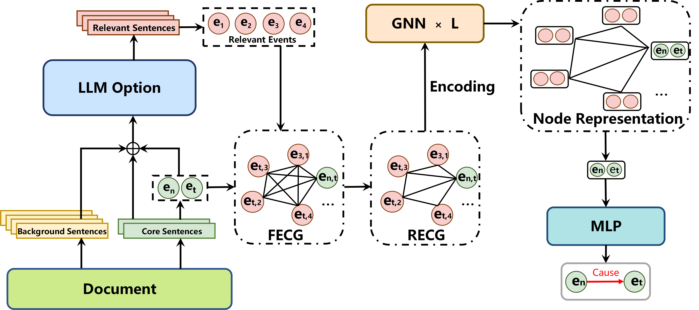

主要用于事件因果判别，数据集是esl

方法参考了ERGO，利用图训练来做，希望能够用到图里的全局推断。但是跟ERGO不一样的是，还用到了大模型。大模型并不是用于编码和判别，是用大模型来给判别事件选相关事件。大模型用作纯判断已经试验过，感觉不行（也可以是我的方法问题）

编码器是longformer。安装好环境，直接python train.py

代码中的一些路径需要更改，请自行查看。附一张图，代码的框架。具体数据处理看data_eci

