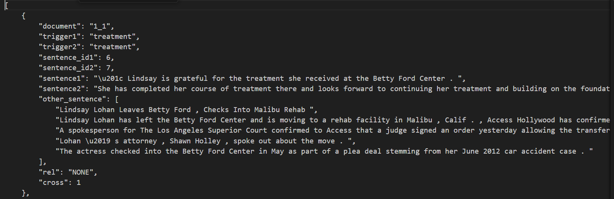

#### pkl是已经处理好的数据文件。train和dev分别是（训练集、测试集）和验证集。train的具体划分方法间train.py,文件再这
通过网盘分享的文件：github_code
链接: https://pan.baidu.com/s/18bzN9EttroRXt7DmZeT_KQ?pwd=tHeH 提取码: tHeH 
--来自百度网盘超级会员v2的分享

#### 由于Llama部署在本地不易，所以筛选部分不展示筛选代码，分享一下过程。

##### 1. 部署llama，见Chinese alpaca llama（github），改写脚本可以一次性输入

##### 2.llama输入的prompt为：

Given two sentences, sentence1 and sentence2, and a list of other sentences, please select from the list the sentences that are most relevant to sentence1 and sentence2, to help provide the best background knowledge for causality identification between the events in sentence1 and sentence2. The number of selected sentences should not exceed three.

所以需要先处理esl数据（0.9版本），我处理出来是这个样子：

然后改写脚本送进去，prompt建议多尝试几次。送出来的就是几个句子，需要匹配一下，如果re匹配不出来，可以用transformer相似度

##### 3训练需要的数据

处理过程有点麻烦。具体就是根据上面的找到对应的事件作为事件图。然后处理。我的pkl文件里面是处理好的，涉及编码的过程用的是longformer

数据的各个部分分别是：

doc_id es文件编码

doc_sid 句子编号

enc_input_ids 文档内容编码（在触发词前后加了\t标签的）

 mh_{}_{}_mask 掩码矩阵，图中连边的 

t1_pos 图中事件对第一个的事件的位置

length 这个图我们需要判别的事件

其余的看了一遍数据集就知道了，不介绍了。处理成这个格式就可以运行了